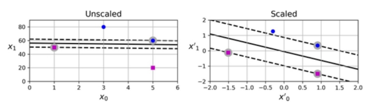

## 목차
1. [선형 SVM 분류](#선형-svm-분류linear-svm-classification)
2. [비선형 SVM분류](#비선형-svm-분류)

<br>

> 서포트 벡터 머신(SVM)은 선형/비선형 분류, 회귀, 특이치 탐색 등 다양한 목적으로 활용될 수 있는 머신러닝 모델임  
SVM은 작은 사이즈 혹은 중간 사이즈의 데이터셋에 적합  

### 선형 SVM 분류(Linear SVM Classification)  
- 직선 형태의 결정 경계를 기준으로 두 클래스 구분
<기본 아이디어>  
클래스 사이에 가장 넓은 결정 경계 도로를 찾는 것이라고 할 수 있음.  
-> 그래서 **라지 마진 분류** 라고 함


-> 3가지 선형 분류기(linear classifier)의 결정 경계  
-> 두 클래스가 선형적으로 구분 가능함  
-> 결정 경계가 샘플에 너무 가까워 새로운 샘플에 대해 잘 작동하지 못할 가능성이 있음  


-> SVM 분류기의 결정 경계(검은 실선)  
-> 두 클래스를 잘 구분  
-> 각 클래스 별 가장 가까운 훈련 샘플로부터 가능한 멀리 떨어져 있음  

**서포트 벡터**
: 두 클래스 사이 결정 경계 도로의 양쪽 가장자리에 위치하는 샘플을 의미


-> 오른쪽 그래프의 동그라미 표시  

SVM 분류기는 서포트 벡터 사이의 간격, 즉 결정 경계 도로의 폭이 최대가 되도록 학습이 이루어짐  
SVM 분류기는 특성 스케일에 민감함  
-> 특성 스케일을 조정하면 결정 경계가 훨씬 넓어짐  

SVM 분류 모델  
: 이진 분류기  
: 양쪽 클래스의 서포트 벡터로부터 최대한 멀리 떨어져 있는 결정 경계를 찾는 분류기  
훈련 목표 : 두 클래스의 샘플들을 잘 구분하면서 동시에 가능한 폭이 넓은 결정 경계 도로를 찾는 것 


**하드 마진 분류**
: 모든 훈련 샘플들이 결정 경계 도로 바깥쪽으로 올바르게 분류되도록 하는 마진 분류  
- 훈련셋의 샘플들이 선형적으로 구분되는 경우에만 가능  
- 이상치에 민감함  


(왼쪽) 
- 이상치가 타 클래스에 섞임
- 하드 마진 분류가 불가능한 경우

(오른쪽)
- 이상치가 타 클래스에 매우 가까움 
- 하드 마진 분류 가능하지만 결정 경계 도로 폭이 좁아 새로운 샘플에 대한 일반화 성능이 떨어질 가능성  

**소프트 마진 분류**
: 훈련 샘플에 대한 예측 오류가 허용되는 경우  
마진 오류 : 샘플이 결정 경계 도로 상이나 혹은 반대편 클래스 영역에 위치하는 경우  
  
훈련 목표 
: 결정 경계 도로의 폭을 가능한 넓게 유지하는 것과 마진 오류 케이스 빈도를 낮추는 것 간의 적절한 균형을 찾는 것이 목표
  
소프트 마진 분류 : 규제, 결정경계 도로, 마진 오류
   
C : 규제 하이퍼파라미터(규제 강도 $a$의 inverse)  
(C가 작을 수록 강한 규제, 클수록 약한 규제)  


(왼쪽)  
- C가 너무 작아(강한 규제) 도로 폭은 넓지만 마진 오류를 너무 많이 허용하는 과소 적합이 발생  
(오른쪽)  
- C를 키우면(약한 규제) 결정 경계 도로 폭이 좁아지며 마진 오류 빈도가 줄어듦  
(도로 폭이 너무 좁아지면 훈련 샘플에 대한 마진 오류는 줄지만 새로운 샘플에 대한 일반화 성능이 떨어질 가능성이 있음 => 즉, 과대적합 가능성)  

이 경우, C=100으로 훈련된 모델의 일반화 성능이 C=1로 훈련했을 때보다 우수할 것으로 보임  


### 비선형 SVM 분류  
비선형 데이터 분류를 위한 한 가지 방안  
: 다항 특성이나 유사도 특성같은 특성  

(하나의 특성 $x_1$만으로 이루어진 데이터 셋 예)  


-> 선형적 분류가 불가능한 케이스  
  

-> 다항 특성 $x_2 = x_1^2$을 추가하면 선형 분류가 가능해진다.

비선형 데이터셋 분류 : (e.g., moons 데이터 셋 분류)
```
from sklearn.datasets import make_moons
from sklearn.preprocessing import PolynomialFeatures

X, y = make_moons(n_samples=100, noise = 0.15, random_state=42)

polynomial_svm_clf = make_pipeline(
    PolynomialFeatures(degree=3),
    StandardScaler(),
    LinearSVC(C=10, max_iter=10_000, random_state=42)
)
# PolynomiaFeatures 변환기를 이용하여 degree=3의 다항 특성 추가
# StandardScaler를 이용한 특성 스케일링 적용
# LinearSVC 분류기 클래스 이용  
polynomial_svm_clf.fit(X, y)
```
* 다항 특성

다항 특성 추가 시 문제점  
- 다항식의 차수(degree)를 높이면 추가되는 다항 특성 수가 엄청나게 많아져서 모델 훈련 과정이 너무 느려지게 된다.  
- 반대로 다항식의 차수를 너무 낮게 설정하면 데이터셋의 비선형적 패턴을 학습하는데 한계가 있음  

-> SVM 모델 사용 시 커널 트릭이라고 하는 수학적 테크닉 적용 가능  
커널 트릭: 다항 커널(Polynomial Kernal)  
: 매우 높은 degree의 다항 특성들을 실제로 데이터셋에 추가하지 않고도 마치 추가한 것과 동일한 효과를 얻을 수 있음  
: 매우 높은 차수의 다항식 이용 시 다항 특성 수의 엄청난 증가 문제를 피할 수 있음  
```
from sklearn.svm import SVC
# 사이킷런 SVC 클래스를 통해 다항 커널 적용 가능  

poly_kernel_svm_clf = make_pipeline(StandardScaler(),
                                    SVC(kernel = "poly", degree=3, coef()=1, C=5))
# degree : 적용할 다항 커널 차수를 지정. 모델이 과대적합 될 경우 다항 커널 차수를 낮춫어 시도
# coef(): 모델이 (low-degree terms 대비) high-degree terms에 의해 얼마나 많이 영향 받도록 할 것인지를 설정                                    
poly_kernel_svm_clf.fit(X, y)
```
  
 * 유사도 특성
 : 비교 대상 기준이 되는 특정 landmark 샘플과 각 샘플 간의 유사도를 측정  
 (e.g., Gaussion RBF 함수 : 종 모양의 함수(landmark에 가까울수록 1, 멀수록 0으로 수렴))  
 유사도 함수를 사용하여 계산된 유사도 특성을 데이터 셋에 추가  

  유사도 특성 추가 시 고려사항  
  유사도 특성 추가 시 필요한 결정 : 훈련셋의 샘플들 중 어느 샘플을 landmark로 지정할 것인지?  
    
간단한 방법 
- 훈련셋의 m개 샘플 모두를 landmark로 지정  
- 각 훈련 샘플에 대해서 m개 샘플(자기 자신 포함) 각각과의 유사도를 각각 측정하여 유사도 특성으로 추가  
-> 각 훈련 샘플 당 m개의 유사도 측정값들이 추가 됨(일반적으로 original 특성들은 drop 시킴)  

문제점  
- m개 샘플과 n개 특성으로 이루어진 훈련셋이 m개 샘플과 m개 특성의 훈련셋의 바뀜  
- if m >> n, 훈련셋의 크기가 엄청나게 커지게 된다.  

유사도 특성에 대한 커널 트릭 : Gaussian RBF Kernel  
Gaussian RBF 함수를 이용한 유사도 특성에 대해서도 커널 트릭 적용 가능함  
- 즉, 훈련셋에 유사도 특성을 실제로 추가하지 않고서도 마치 추가한 것과 동일한 효과를 얻을 수 있음  
```
rbf_kernel_svm_clf = make_pipeline(StandardScaler(),
                                    SVC(kernel = "rbf", gamma=5, C=0.001))
# gamma : landmark로부터 멀어짐에 따라 Gaussian RBF 함수 유사도 측정값이 얼마나 빠르게 감소되도록 할 것인지 설정  
# gamma 증가 -> 종 모양 커브가 좁아짐 -> 각 샘플이 영향을 미치는 범위가 더 작아짐 -> 클래스 간 결정 경계가 더 불규칙한 패턴을 띄게 됨 
# gamma 감소 -> 종 모양 커브 넓어짐 -> 각 샘플이 영향을 미치는 범위가 더 넓어짐 -> 클래스 간 결정 경계가 더 smooth 해짐 
rbf_kernel_svm_clf.fit(X, y)
```

gamma 값이 지나치게 커지면 모델이 과대적합이 될 수 있고 gamma 값이 지나치게 작으면 과소적합이 될 수 있음  
-> 따라서 gamma가 규제 하이퍼파라미터 같은 역할을 함  
(모델이 과대 적합 될 경우 gamma값을 줄이고, 과소 적합 될 경우 gamma값을 키운다.)  
  
 
 
 - LinearSVC
: 커널 트릭 지원하지 않음
: 훈련 시간 복잡도는 m과 n에 대해 선형적으로 증가  

- svc
: 커널 트릭 지원  
: 훈련 샘플 수(m)가 많아지면 훈련 시간이 굉장히 길어짐. 따라서 small or medium-sized dataset에 적합  
: 상대적으로 특성 수 면에서는 확장성이 있음  

- SGDClassifier(을 이용하여 large margin 분류 수행 가능)  
: 규제 하이퍼파라미터와 학습률 하이퍼파라미터를 조절함으로써 Linear SVM과 유사한 결과를 도출할 수 있다.  
: 확률적 경사 하강법을 통해 훈련되므로 점진적 학습이 가능하며 외부 메모리 학습 가능  

어떤 커널을 사용해야 할까?  
- 사이킷런 SVC 클래스의 default kernel 값은 Gaussian RBF 커널(SVC(kernel="rbf"))  
=> 대부분의 경우 Gaussian RBF 커널이 잘 맞음  
  
- 선형 모델이 예상되는 경우  
=> SVC(kernel="linear")를 시도해 볼 수 있지만, 훈련 샘플 수(m)나 특성 수(n)가 매우 많은 경우에는 LinearSVC 클래스가 훨씬 빠름   

- 시간과 컴퓨터 성능 면에서 여유가 된다면
=> 교차 검증, 그리드 탐색을 통해 적절한 커널을 탐색해 볼 수 있음  

- 훈련 데이터에 특화된 커널이 알려져 있다면  
=> 해당 커널을 사용   
(e.g., 문서 분류나 DNA sequence 분류 문제의 경우 string kernel이 많이 사용됨)  