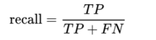

# 기계학습 기말
## 목차  
1. [Part 1](#part-1)    
    1-1 [MNIST 데이터 셋](#mnist-데이터-셋)  
    1-2 [이진 분류기 훈련](#이진-분류기-훈련)  
    1-3 [분류기 성능 측정](#분류기-성능-측정)  
2. [Part 2](#part-2)  
    2-1 [다중 클래스 분류](#다중-클래스-분류)  
    2-2 [에러 분석](#에러-분석)  
    2-3 [다중 레이블 분류](#다중-레이블-분류)  
    2-4 [다중 출력 분류](#다중-출력-분류)  

### Part 1
#### MNIST 데이터 셋  

hihihihihih
<b>MNIST 데이터 셋</b>  
: 미국 고등학생과 인구 조사국 직원들이 손으로 쓴 70,000개의 숫자 이미지로 구성된 데이터 셋   
(0~9까지 숫자들에 대한 손글씨 이미지)     
  
  
  
이미지  
: 각 이미지는 28x28=784 개의 픽셀들로 구성된 이미지 데이터  
: 각 이미지는 2차원 배열이 아닌 길이가 784인 1차원 배열로 제공  
: 이미지 데이터 셋의 shape은 (70000,784) 
   
레이블   
: 총 70,000개의 사진 샘플들 각각이 어떤 숫자를 나타내는지에 대한 레이블링이 되어 있음  
: 레이블 데이터 셋의 shape은 (70000,)  

> 문제 정의  
>- 지도 학습 (각 이미지가 어떤 숫자를 나타내는지에 대한 레이블이 지정되어 있음)  
>- 분류 : 주어진 이미지 데이터가 0~9 중 어떤 숫자에 해당하는지 예측  
>    - 0~9까지의 숫자 각각이 하나의 클래스에 해당  
>    - 주어진 이미지 데이터가 총 10개의 클래스 중 어느 클래스에 해당하는지 분류  -> 다중 클래스 분류(multiclass classification) 또는 다항 분류(multinomial classification)    
>- 배치 또는 온라인 학습 : 둘 다 가능
>   - 확률적 경사하강법(SGD) 분류기 : 배치와 온라인 학습 모두 가능
>   -  랜덤 포레스트 분류기 : 배치 학습  

#### 이진 분류기 훈련 
<b>- 숫자 5 감지기 -</b> 

-> 다중 클래스 분류 모델을 훈련하기에 앞서 주어진 샘플이 숫자 5에 해당하는지 여부를 판단하는 이진 분류기(binary classifier)를 훈련시키고자 함  
-> 이를 통해 분류기의 기본 훈련 과정과 성능 평가 방법을 알아보고자 함  
   
각 이미지에 대한 레이블은 0 또는 1로 수정되어야 함  
(레이블 0 : 해당 숫자 X, 레이블 1 : 해당 숫자 O)  
  
```
y_train_5 = (y_train == '5')
y_test_5 = (y_test == '5')
```

* 이진 분류기로 SGD 분류기 활용  
> SGD Classifier이란?
> - 확률적 경사 하강법(stochastic gradient descent) 분류기
> - 한번에 하나씩 훈련 샘플을 이용하여 학습한 후 파라미터를 조정
> - 매우 큰 데이터 셋 처리에 효율적이며 온라인 학습에도 적합  
> - 사이킷런의 SGDClassifier 클래스 활용 
  
```
from sklearn.linear_model import SGDClassifier 

sgd_clf = SGDClassifier(random_state=42)
sgd_clf.fit(X_train, y_train_5)

sgd_Clf.predict([some_digit]) # predict() 메소드 호출을 통해 주어진 이미지가 0 또는 1 중 어느 클래스에 해당하는지 예측  
```
  
#### 분류기 성능 측정  
분류기 성능 평가는 회귀 모델 평가보다 고민할 점들이 많음  
  
 > 분류기 성능 측정 기준  
 > - 정확도(accuracy)  
 > - 정밀도(precision) / 재현율(recall)  
 > - ROC curve의 AUC

 <b> 정확도(accuracy) </b>  
 (옳게 분류된 샘플 수) / (전체 샘플 수) -> 분류기에 의해 올바르게 분류된 샘플들의 비율  
     
 교차 검증을 사용한 정확도 측정  
: k-fold 교차 검증(cross validation) 기법을 이용하여 SGD 분류기의 성능 평가  
: 사이킷 런의 cross_val_score() 함수 활용  
: cross_val_score() 반환 값은 성능 지표 측정값을 배열 형태로 반환 함. 개수는 cv(폴드 수)만큼 들어있다. 일반저긍로 이를 평균한 값을 평가 수치로 사용 함.

```
from sklearn.model_selection import cross_val_score  

# cross_val_score(모델 명,훈련데이터, 타깃,cv,평가지표)
cross_val_score(sgd_clf, X_train, y_train_5, cv=3, scoring="accuracy") 
```
```
# 결과  
array([0.95035, 0.96035, 0.9604]) #95%가 넘는 정확도를 보임
```
  
무조건 '5가 아님'으로 찍는 DummyClassifier 분류기를 생성하여 정확도 측정  
```
from sklearn.dummy import DummyClassifier

dummy_clf = DummyClassifier()
dummy_clf.fit(X_train, y_train_5)  

cross_val_score(dummy_clf, X_train, y_train_5, cv=3, scoring="accuracy") 
```
```
# 결과
array([0.90965, 0.90965, 0.90965])
```
- 무조건 '5가 아님'을 찍는 경우에도 90% 넘는 정확도를 보임  
(훈련셋의 10%만 숫자 5의 이미지이고 나머지 90%는 5가 아닌 이미지이기 때문)  
    
결론  
: 이처럼 훈련셋 샘플들의 <b>클래스 불균형이 심한 경우</b>에는 분류기의 성능 측정 지표로 <b>정확도는 부적합</b>
  
오차 행렬(Confusion Matrix)  
: 클래스 별 예측 결과를 정리한 행렬  
: 행은 실제 클래스를(true label), 열은 분류기에 의해 에측된 클래스(predicted label)를 의미  
  
> if. 아래 오차 행렬에서 cat에 해당하는 이미지 샘플을 dog으로 잘못 분류한 횟수를 알고 싶다면 (cat 행, dog 열)에 위치한 값을 확인  
>     
>  

숫자 5-감지기에 대한 오차 행렬
- cross_val_predict() : k-fold 교차 검증 수행, 각 validation fold의 샘플들에 대해 분류기가 에측한 결과(y_train_pred)를 반환  
- confusion_matrix() : 타깃 클래스(y_train_5)와 예측된 클래스(y_train_pred) 정보를 이용하여 숫자 5-감지기에 대한 오차 행렬 생성

```
from sklearn.model_selection import cross_val_predict
from sklearn.metrics import confusion_matrix

y_train_pred = cross_val_predict(sgd_clf, X_train, y_train_5, cv=3)
cm = confusion_matrix(y_train_5, y_train_pred)
cm
```
```
# 결과
array([[53892,  687],
       [1891,  3530]])
# 행은 실제 클래스 열은 분류기에 의해 에측된 클래스이므로
-------------------------------
|            | 0      |  1    | 
-------------------------------            
|5가 아닌 숫자| 538892 | 687   |
-------------------------------
|5인 숫자     | 1891   | 3530  |
-------------------------------  -> 2x2행렬
 
---------------------------------------------------------
|            |   0                |   1                 | 
---------------------------------------------------------            
|5가 아닌 숫자| True Negative(TN)  | False Positive(FP)  |
---------------------------------------------------------
|5인 숫자     | False Negative(FN) | True Positive(TP)   |
--------------------------------------------------------- 
```
TN : 실제 5가 아닌 이미지를 5가 아닌거(N)로 옳게(T) 예측한 경우  
TP : 실제 5 이미지를 5로 예측(P)을 옳게(T) 경우  
FN : 실제 5인 이미지를 5가 아닌거(N)로 틀리게(F) 예측한 경우  
FP : 실제 5가 아닌 이미지를 5로 예측을(P) 틀리게(F) 경우  
     
-> 오차 행렬이 분류 결과에 대한 많은 정보를 제공하지만 더 요약된 지표가 필요함 ( 정밀도, 재현율 )  
  
<b> 정밀도(Precision), 재현율(Recall) </b>  
<hr>

- <b>정밀도</b>  
: positive 예측의 정확도를 나타내는 지표   
(positive라고 예측한 샘플(instance) 중 실제 positive인 인스턴스의 비율)  
<image src = "../image/정밀도.png" width = 50%>

정밀도(precision)가 높다는 것은 분류기가 주어진 샘플(instance)을 <b>positive라고 예측하면 그 예측이 맞을 확률이 높다</b>는 의미  

<br> 

앞서 살펴본 SGD classifier의 정밀도  
array([[53892,  687],  
&emsp;&emsp;[1891,  3530]])  
: 3530 / 3530 + 687 = 0.83708..  

> 정밀도 100%를 달성할 수 있는 간단한 방법  
기본적으로 항상 non-5로 예측하다가 5가 확실한 이미지 샘플 하나만 5로 예측  
(FP=0 & TP=1 -> Precision = 1)    
-> 이러한 분류기는 숫자 5인 이미지들 중 오직 하나만 5로 예측한 것이기 때문에 전혀 유용하지 x  
-> 결과적으로 정밀도만으로는 좋은 분류기를 가려낼 수 없으며, 정밀도를 보완할 성능 지표가 추가로 필요함  


- <b>재현율</b>   
: positive 샘플(실제 5인 애들)에 대한 예측 정확도  
(데이터셋에 포함된 모든 positive instance들 중에서 분류기가 positive라고 분류한 비율 -> 실제 5인 애들 중 예측기가 5라고 예측한 애들)      



재현율이 높다는 것은 분류기가 positive instance를 놓치지 않고 잘 감지해낸다는 의미  
array([[53892,  687],  
&emsp;&emsp;[1891,  3530]])  
: 3530 / 3530 + 1891 = 0.6511..  
<br>

- 정밀도와 재현율의 조화 평균(harmonic mean)(F1 Score)  
: 서로 다른 종류의 두 분류기 모델의 성능을 하나의 metric으로 비교하고자 할 때 유용  


```
from sklearn.metrics import f1_score  

f1_score(y_train_5, y_train_pred)  
```
```
결과
0.7325171197343846
```
> F1 Score 계산 시 정밀도와 재현율에 대한 가중치 설정  
위 계산 식은 정밀도와 재현율을 동일한 중요도로 반영하여 F1 Score 계산하는 경우  
경우에 따라서는 정밀도와 재현율 중 하나에 더 높은 가중치를 두어야 할 때도 있음  


- <b>정밀도(Precision) vs 재현율(Recall)</b>  
: 모델 사용의 목적에 따라 정밀도와 재현율의 중요도가 상이할 수 있음   
: 정밀도와 재현율은 trade-off 관계임(상호 반비례 관계)     
: 정밀도와 재현율 모두 높은 분류기는 이론적으로 불가능  
(주어진 문제 성격에 따라 요구되는 최소한의 정밀도/재현율 수준이 있을거고 그것을 충족시키는 분류기를 도출해야 함 -> 분류기가 주어진 샘플의 클래스를 예측하는 기본 원리에 대한 이해 필요)  
  
> 정밀도 < 재현율 (재현율이 더 중요한 경우)    
> : e.g., 암 진단 분류기   
(암인 케이스를 놓치지 않고 암으로 예측하는 것이 중요)  
정밀도 : 암(즉, positive)으로 진단된 경우 중에 실제로 암인 경우의 비율  
(암으로 진단한 경우에 대한 신뢰도/정확도를 의미)  
재현율 : 실제로 암인 경우들 중에서 놓치지 않고 암으로 진단한 경우의 비율  
>> 재현율을 높이려면 조금이라도 암일 가능성이 있는 케이스를 암으로 진단해야 함.
 정밀도가 떨어짐 (암으로 진단한 경우 중 실제로는 암이 아닌 비율이 높아짐)


  
> 정밀도 > 재현율 (정밀도가 더 중요한 경우)  
> : e.g.,아이가 시청해도 되는 안전한 동영상 분류기  
(안전한 동영상으로 예측된 샘플 중에 실제로 안전하지 않은 동영상이 포함된 경우 문제가 됨)  
정밀도 : 안전(즉, positive)하다고 판단된 동영상 중에 실제로 안전한 동영상 비율  
재현율 : 실제 안전한 동영상 중 안전하다고 예측된 영상 경우의 비율  
>> 정밀도를 높이려면 확실하게 안전하다고 판단되는 영상만 안전한 것으로 예측해야 함.  
재현율이 떨어짐 (실제 안전한 동영상임에도(작은 이유로) 안전하지 않다고 예측하는 비율이 높아짐)  


- 결정 함수(Decision Function)와 결정 임계값(Decision Threshold)  
: SGD 분류기는 결정 함수를 사용해 주어진 샘플 클래스를 결정하기 위한 점수를 계산 함  
: if 계산된 점수 > 결정 임계값 => positive 클래스(e.g., 숫자 5 클래스)로 예측  
: if 계산된 점수 < 결정 임계값 => negative 클래스(e.g., non-5 클래스)로 예측  


<임계값을 높이면 정밀도는 높아지지만 재현율은 떨어짐>  
<임계값을 낮추면 정밀도는 떨어지지만 재현율은 높아짐>   


```
y_scores = cross_val_predict(sgd_clf, X_train, y_train_5, cv=3, method="decision_function")
# k-fold 교차 검증 수행하며 결과로는 훈련셋의 각 인스턴스에 대해 decision function을 통해 계산된 점수를 반환

from sklearn.metrics import precision_recall_curve

precisions, recalls, thresholds = precision_recall_curve(y_train_5, y_scores)
# 모든 가능한 결정 임계값에 대해 SGD 분류기의 precision과 recall을 계산해서 반환
```
< 결정 임계값에 따른 정밀도와 재현율 그래프 >


- 세로 방향 점선으로 표시된 결정 임계값을 사용할 경우 대략 90% 정밀도와 50% 재현율을 달성함  
- 결정 임계값이 아주 클 때 일시적으로 정밀도가 떨어질 수 있지만 결국엔 상승

< 재현율 대 정밀도 그래프 >
  


* 결정 임계값 찾기  

e.g.1, precision_recall_curve()함수를 통해 계산된 precisions, recalls, thresholds 배열을 이용해 재현율 0.9 이상을 충족시키기 위한 결정 임계값 최소치 찾기  
  
```
idx_for_90_precision = (precisions >= 0.90.argmax())
# precision 배열에서 값이 0.9 이상인 lowest index 확인
threshold_for_90_precision = thresholds[idx_for_90_precision]
# 확인된 index 위치에 해당하는 결정 임계값을 thresholds 배열에서 확인하면 그 임계값이 정밀도 0.9 이상을 충족시키는 임계값 최소치임
threshold_for_90_precision
```
```
# 결과
3370.0194991439557
```

e.g.2, precision_recall_curve()함수를 통해 계산된 precisions, recalls, thresholds 배열을 이용해 재현율 0.8 이상을 충족시키기 위한 결정 임계값 최대치 찾기  
  
```
idx_for_80_recall = (recalls >= 0.80.argmin())
# recalls 배열은 값이 줄어드는 패턴
# recalls 배열에서 값이 0.8 미만인 lowest index 확인
thresholds[idx_for_80_recall-1] # idx_for_80_recall-1 인덱스의 위치의 임계값이 재현율 80% 이상을 충족시키기 위한 임계값 최대치에 해당
y_train_pred_80_recall = (y_scores >= thresholds[idx_for_80_recall-1]) # 선택된 임계값으로 훈련셋 샘플들에 대한 예측 수행
precision_score(y_train_5, y_train_pred_80_recall) # 타깃과 예측 클래스를 이용해 precision socre 계산
recall_score(y_train_5, y_train_pred_80_recall) # 타깃과 예측 클래스를 이용하여 recall score 계산
```

* ROC 곡선
: ROC(receiver operating characteristic) 곡선은 결정 임계값이 달라짐에 따라 FPR과 TPR의 변화 추이를 보여주는 곡선
  - TPR(true positive rate): 재현율의 또 다른 명칭   
  - FPR(false positive rate) : 실제 negative 클래스에 해당하는 모든 샘플들 중 positive로 잘못 예측된 비율 (FPR = FP / (FP + TP))  
: ROC 곡선은 이진 분류기 성능 평가에 널리 사용됨.  
: ROC 곡선을 그리려면 모든 가능한 임계값에 대해 FPR과 TPR을 계산해야 함.
```
from sklearn.metrics import roc_curve

fpr, tpr, thresholds = roc_curve(y_train_5, y_scores)
# roc_curve() 함수를 이용하면 모든 가능한 임계값에 대한 FPR과 TPR계산 가능
```

SGD 분류기에 대한 ROC 곡선
- FPR과 TPR(재현율)은 비례관계 (결정 임계값 조정을 통해 TPR을 높이면 FPR 증가)
- 좋은 분류기이기 위해서는 FPR은 최대한 낮게 유지하면서 높은 수준의 TPR에 도달할 수 있어야 함
- 좋은 분류기의 ROC 곡선은 top-left 코너에 근접하게 됨  


AUC(area under the curve)  
: ROC 곡선의 AUC는 ROC 곡선 아래의 면적을 위미함  
: AUC가 1에 가까울 수록 좋은 성능의 분류기로 평가됨  

<b> ROC 곡선 vs 정확도/재현율 곡선 </b>

> 정확도/재현율 곡선이 선호되는 경우
> - 전체 샘플들 중 positive 클래스에 해당하는 샘플들이 드문 경우
> - false negative 보다 false positive가 더 문제되는 경우
>(e.g., 아이가 시청해도 되는 안전한 동영상 분류기 - 아이가 보면 안되는 위험한 동영상(negative 클래스)인데 안전한 것(positive 클래스)으로 분류되는 것이 더 심각함)


> 나머지 경우 ROC 곡선이 선호됨 


정확도/재현율 곡선을 이용한 분류기 성능 비교
- 좋은 분류기이기 위해서는 높은 수준의 recall에서도 높은 수준의 precision을 유지할 수 있어야 함
- 분류기의 정확도/재현율 곡선이 top-right 코너에 근접할 수록 좋은 성능의 분류기로 평가됨
( 정확도/재현율 곡선의 AUC 또한 1에 가까울 수록 좋은 분류기라는 의미)  


SGD 분류기 vs Random Forest 분류기


### Part 2  
#### 다중 클래스 분류  
: 주어진 샘플이 3가지 이상의 클래스들 중 어느 클래스에 해당하는지 예측하는 것   
: 다항 분류기(multinomial classifier)라고도 부름  
(e.g., 손글씨 숫자 이미지 분류의 경우 주어진 손글씨 이미지가 0~9까지 클래스 중 어느 클래스에 해당하는지 예측하는 경우)  

> 다중 클래스 분류를 기본으로 지원하는 사이킷런 분류기
> - LogisticRegression
> - RandomForestClassifier  
> - GaussianNB


> 이진 분류만을 지원하는 분류기
> - SGDClassifier  
> - SVC (Support Vector Machine Classifier)  


이진 분류기 여러 개를 사용하여 다중 클래스를 수행할 수 있는 방법  
이진 분류기 여러 개를 활용한 다중 클래스 분류 전략  
- 일대다 OvR(one-versus-the-rest)(= OvA(one-versus-all))  
- 일대일 OvO(one-versus-one)


><b><일대다(OvR) 방식을 통한 다중 클래스 분류></b>  
>  
> * 0~9 손글씨 숫자 이미지 분류 예
>- 이진 분류 방식을 0~9까지 각 숫자 클래스에 동일하게 적용  
>-> 0-detector, 1-detector, ..., 9-detector까지 총 10개 이진 분류기를 훈련  
>- 새로운 이미지 샘플이 주어지면 10개 이진 분류기를 각각 실행하여 decision score을 얻는다.  
>- 가장 높은 score가 관찰된 감지기의 클래스로 예측  
>(e.g., 2-detector의 decision score가 가장 높다면 숫자 2 이미지로 예측)  

> <b><일대일(OvO) 방식을 통한 다중 클래스 분류></b>  
> : 모든 가능한 2가지 클래스 조합 각각에 대해 이진 분류기를 훈련시키는 방법  
>  
> * 0~9 손글씨 숫자 이미지 분류 예
> - 0-1 분류기, 0-2 분류기,..., 8-9 분류기 등, N=10 이므로 10 C 2 = 45개의 이진 분류기가 필요함  
> - 새로운 이미지 샘플이 주어지면 45개 이진 분류기를 실행하여 가장 많이 예측된 클래스로 최종 예측  
> (e.g., 숫자 1 클래스와 관련된 총 9개 분류기(0-1, 1-2, 1-3, 1-4, 1-5, 1-6, 1-7, 1-8, 1-9 분류기) 모두 숫자 1로 예측했다면 숫자 1로 최종 예측)  
>  
> 장점  
> - 각 분류기의 훈련에 전체 훈련셋 중 구별할 두 클래스에 해당하는 샘플만 필요함  


SVM(Support Vector Machine) 같은 일부 머신러닝 알고리즘은 훈련셋 크기에 민감함
  - 큰 훈련셋으로 적은 수의 분류기를 훈련시키는 것보다 작은 훈련셋으로 많은 수의 분류기를 훈련 시키는 쪽이 빠름.
  - 따라서 훈련셋 크기에 민감한 알고리즘에서는 OvO 전략이 선호됨
  - 하지만 대부분의 이진 분류 알고리즘에서는 OvR 전략을 선호함  

SVM Classifier 예  
<b> SVC 클래스를 사용하여 SVM 분류기 훈련</b>

```
from sklearn.svm import SVC

svm_clf = SVC(random_state=42)
svm_clf.fit(X_train[:2000], y_train[:2000]) 
# y_train_5가 아닌 0~9까지의 y_train을 사용해 훈련  
# 처음 2000개 훈련 샘플들만으로 훈련(전체일 경우 시간이 많이 걸림)
# 내부적으로 OvO전략을 사용해 45개 이진 분류기를 훈련시킴

some_digit_scores = svm_clf.decision_function([some_digit])
some_digit_scores.round(2)
# 새로운 샘플(some_digit)에 대해 45개 이진 분류기를 실행해 클래스 별 결정 점수를 얻어 점수가 가장 높은 클래스를 최종 예측값으로 결정(e.g., 숫자 5 클래스)
# 결과 : array([3.79, 0.73, 6.06, 8.3, -0.29, 9.3, 1.75, 2.77, 7.21, 4.82])
class_id = some_digit_scores.argmax()
class_id
```
```
# 결과
array([3.79, 0.73, 6.06, 8.3, -0.29, 9.3, 1.75, 2.77, 7.21, 4.82])
5 (5번 인덱스가 9.3으로 점수가 가장 높음)
```

분류기가 훈련될 때 classes_속성에 타깃 클래스들의 리스트를 값을 기준으로 정렬하여 저장함.
```
svm_clf.classes_
```
```
# 결과
array(['0','1','2','3','4','5','6','7','8','9'], dtype=object)
```
```
svm_clf.classes_[class_id]
```
```
'5'
```
사이킷런에서 OvO나 OvR을 사용하도록 강제하려면 OneVsOneClassifier나 OneVsRestClassifier를 사용.  
예. SVC 기반으로 OvR 전략을 사용하는 다중 분류기  
```
# 훈련
from sklearn.multiclass import OneVsRestClassifier

ovr_clf = OneVsRestClassifier(SVC(random_state=42))
ovr_clf.fit(X_train[:2000], y_train[:2000])

# 예측
ovr_clf.predict([some_digit])
len(ovr_clf.estimators_)
```
```
# 결과
array(['5'],dtype='<U1')
10
```

SGDClassifier 사용 예  
- SGDClassifier는 기본적으로 다중 클래스 분류를 지원하기 때문에 별도로 OvR이나 OvO를 적용할 필요가 없음  
```
# 훈련
sgd_clf = SGDClassifier(random_state=42)
sgd_clf.fit(X_train, y_train)

# 예측
sgd_clf.predict([some_digit])
sgd_clf.decision_function([some_digit]).round() # 클래스 별 결정 점수 확인
```
```
array(['3'], dtype='<U1')
array([[-31893., -34420., -9531., 1824., -22320., -1386., -26189., -16148., -4604., -12051.]])
```

교차 검증을 통한 분류기 성능 평가  
- 분류기 성능 평가에는 일반적으로 교차 검증을 사용함  
- 0~9 손글씨 숫자 이미지 분류 문제의 경우 클래스 별 이미지 수가 균등하기 때문에 accuracy를 지표로 사용하면 됨
```
cross_val_score(sgd_clf, X_train, y_train, cv=3, scoring="accuracy")
```
```
# 결과
array([0.87365, 0.85835, 0.8689])
```

StandardScaler() 사용하여 특성 스케일링을 하면 성능이 향상 됨  
```
from sklearn.preprocessing import StandardScaler
scaler = StandardScaler()
X_train_scaled = scaler.fit_transform(X_train.astype("float64"))
cross_val_score(sgd_clf, X_train_scaled, y_train, cv=3, scoring="accuracy")
```
```
# 결과 
array([0.8983, 0.891, 0.9018])
```

#### 에러 분석   
: 최종적으로 선택된 모델이 어떤 종류의 예측 에러를 범하는지를 분석함으로써 모델의 성능을 추가적으로 향상시킬 방법을 모색  
   
> 실제 머신러닝 프로젝트라면  
> - 데이터 분석 및 전처리 수행  
> - 여러 종류의 머신러닝 모델을 시도해봄
> - 성능이 우수한 몇 가지 모델을 추린 다음 그리드 탐색, 랜덤 탐색 등을 통한 하이퍼파라미터 튜닝 수행

여기서는 위 과정을 통해 가장 성능이 좋은 모델을 하나 찾았다고 가정  
- sgd_clf(SGDClassifier 객체)를 최종 선택된 모델로 가정  

<b> 오차 행렬(Confusion Matrix) </b>

- 오차 행렬을 분석하면 분류기의 성능 향상 방안에 대한 통찰을 얻을 수 있음
(분류기의 예측 오류가 주로 어떤 케이스들에 대해서 발생하는지를 확인할 수 있음)  

```
from sklearn.metrics import ConfusionMatrixDisplay

# 교차 검증을 통해 훈련 샘플들에 대한 분류기의 예측 결과를 생성(y_train_pred)
y_train_pred = cross_val_predict(sgd_clf, X_train_scaled, y_train, cv=3 )
# 분류기의 예측 값과 실제 타깃 데이터를 입력으로 오차 행렬 생성
ConfusionMatrixDisplay.from_predictions(y_train, y_train_pred)
plt.show()
```


5번 행이 상대적으로 어두운 것에 대한 가능한 이유  
- 이는 숫자 5 이미지에 대한 분류 정확도가 상대적으로 낮기 때문일 수 있음
- 데이터셋에 숫자 5 이미지 수 자체가 적기 때문일 수 있음
-> 원인을 명확하게 파악하기 위해서는 <b> 오차 행렬에 대한 정규화가 필요</b>  

```
ConfusionMatrixDisplay.from_predictions(y_train, y_train_pred, normalize = "true", values_format = ".0%")
plt.show()
```

L 오른쪽 그림 : 각 행 별로 퍼센티지 합이 100이 되도록 정규화 적용  

올바른 분류 케이스들은 제외하고 잘못 분류된 케이스들만에 대한 비율 분석  


- 각 행 별 퍼센티지 합이 100이 되도록 정규화 됨
- 숫자 8로 잘못 분류되는 비율이 가장 높음.
(잘못 예측한 샘플들 중 34%가 8로 잘못 예측된 케이스들이었으며, 36%가 9로 잘못 예측된 케이스들이었음을 의미)  


- 각 컬럼 별 퍼센티지 합이 100이 되도록 정규화 됨
(컬럼 7을 보면, 7로 잘못 분류된 케이스들 중 56%가 실제 숫자 9 이미지들이었음을 의미)  

위의 오차 행렬을 보면 8로 잘못 분류되는 케이스들을 줄이도록 분류기를 개선할 필요가 있어보임  
=> 실제 8이 아니지만 8처럼 보이는 이미지 샘플들을 더 많이 모아서 실제 8과 구분하도록 분류기를 추가적으로 학습시킬 수 있음
=> 분류기에 도움이 될 만한 특성을 찾아서 추가하는 방안도 생각해 볼 수 있음  
(e.g., 숫자 이미지에 포함된 동심원의 수를 카운트해서 특성으로 추가(8은 2개, 6은 1개, 5는 0개 등))
  


- 분류기가 잘못 분류한 이미지들 중 일부는 정말 잘못 쓰여 있어서 사람도 분류하기 어려워 보임
- 하지만 대부분의 잘못 분류된 이미지들은 확실히 예측 에러인 것으로 보임
- 그 원인은 단순한 형태의 선형 모델인 SGDClassifier를 사용했기 때문으로 예측 성능이 떨어지는 것으로 추정 됨

데이터 증식(Data Augmentation)  
: 보다 좋은 성능의 모델을 사용할 수도 있지만 기본적으로 보다 많은 훈련 이미지가 필요하다.  
: 기존 데이터셋의 이미지를 조금씩 회전하거나, 뒤집거나, 이동시키는 방식 등으로 생성된 이미지를 훈련셋에 추가할 수 있음  

<hr>

다중 클래스 분류 일반화  
- 다중 레이블 분류(multiabel classification)  
- 다중 출력 분류(multioutput classification)  
  
#### 다중 레이블 분류  
: 하나의 샘플에 대한 예측 결과로 여러 개의 클래스에 대응되는 경우  
: 하나의 샘플에 대해 여러 개의 binary tag를 출력하는 분류 시스템  
(즉, 각 레이블 당 가능한 출력 값은 True or False)  
(e.g., Alice, Bob, Charlie 세 사람의 얼굴을 인식하도록 훈련된 분류기를 가정->분류기의 출력 값 [T,F,T], Alice와 Charlie는 있고 Bob은 없음을 의미)  


#### 다중 출력 분류  
: 각 레이블 당 가능한 클래스가 3개 이상이 될 수 있도록 일반화한 것  
: 다중 출력 다중 클래스(Multioutput Multiclass) 분류라고도 불림  
  
e.g., 이미지 노이즈를 제거 모델
- 다중 레이블 : 각 픽셀이 모델이 예측해야 하는 레이블 하나에 해당.(즉, 모델 실행 결과로 픽셀 수만큼의 예측 값이 출력 됨)  
- 다중 클래스 : 각 픽셀에 대한 레이블 값은 0~255 중 하나임    
```
#MNIST 데이터셋 이미지로부터 노이즈가 추가된 이미지 샘플들을 생성해 훈련셋 데이터 및 테스트셋 구성 

np.random.seed(42)
noise = np.random.randint(0,100, (len(X_train), 784))
X_train_mod = X_train + noise # 노이즈 추가된 훈련 샘플들
noise = np.random.randint(0, 100, (len(X_test), 784))
X_test_mod = X_test + noise # 노이즈 추가된 테스트용 이미지 샘플들
y_train_mod = X_train # 노이즈 추가 전 원본 이미지 샘플들
y_test_mod = X_test # 노이즈 추가 전 원본 테스트셋 이미지 샘플들  
```
  
 
```
# 노이즈 제거를 위한 KNN 분류기 모델 훈련  
knn_clf = KNeighborsClassifier()
knn_clf.fit(X_train_mod, y_train_mod)

# 노이즈가 추가된 X_test_mod[0]에 대해 노이즈 제거 분류기 실행과 예측 결과 plotting  
clean_digit = knn_clf.predict([X_test_mod[0]])
plot_digit(clean_digit())
plt.show()
```
<b>결과</b>
  
  

