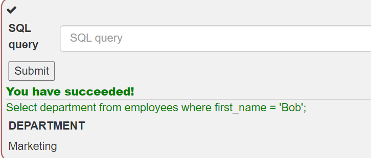
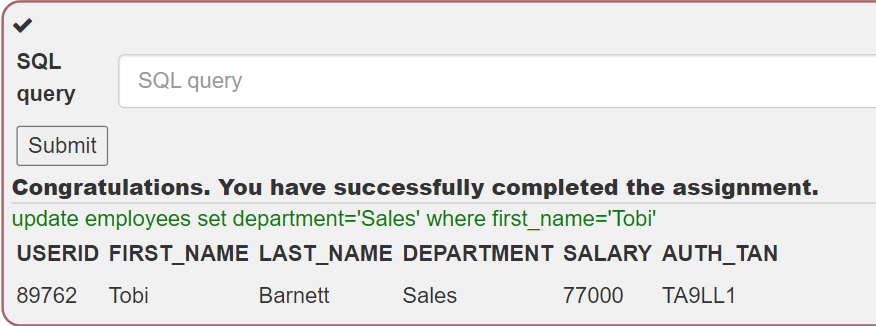
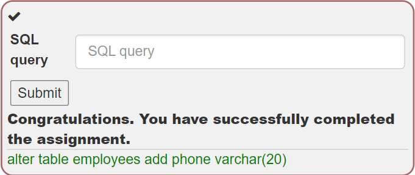

# WebGoat 실습
## 목차
1. A1 Injection  
    1-1 [(A1) Injection(intro)](#sql-injectionintro)  
2.  
3.  
4.  
5.  
6.  
7. A7 Cross-Site Scripting(XSS)  
    7-1 [Cross Site Scripting
](#a7-cross-site-scriptingxss)  

## (A1) Injection
### SQL Injection(intro)
<b>[1]</b>   
1-1에서 배울 것

- SQL이 무엇인가
- 개발자의 원래 의도가 아닌 작업을 수행하도록 조작하는 방법

<b>[2 개념]</b>  
SQL(Structured Query Language)이란?  
: 관계형 databases를 관리하고 database 안에서 data에서 다양한 작업을 수행하기 위해 사용되는 표준화된(ANSI in 1986, ISO in 1987) 프로그래밍 언어이다.  

database : data의 모임     
data : 행들, 열들, 테이블들로 구성됨 그리고 관련 정보를 쉽게 찾을 수 있도록 indexing 됨  
   

[2의 문제]   
아래 Employees Table에서 Bob Franco의 부서를 이끌어 내라   

[2의 답]  

<b>[3 개념]</b>  
DML(Data Manipulation Language)란?  
: 테이블 안에 있는 데이터를 다룬다.  

- SELECT : 하나의 database로부터 데이터를 도출한다.
- INSERT : 하나의 table에 데이터를 삽입한다.
- UPDATE : 하나의 table 내부에 존재하는 데이터를 update(수정) 한다.  
- DELETE : 한 database table로부터 모든 기록들을 삭제한다.  

[3의 문제]   
Tobi Barnett의 부서를 'Sales'로 부서를 바꿔봅시다.  
[3의 답]

<b>[4 개념]</b>  
DDL(Data Definition Language)란?  
: 데이터를 정의하는 언어  
: 어떤 데이터 베이스, 스키마, 테이블이 필요한지 등 데이터의 구조를 설계  

- CREATE : 데이터베이스, 테이블 등을 생성
- ALTER : 존재하는 데이터베이스, 테이블의 구조를 수정한다.
- DROP : 데이터베이스, 테이블을 삭제

[4의 문제]  
employees 테이블에 "phone" column(varchar(20))을 추가하여 scheme를 수정해봅시다.   
[4의 답]

<b>[5 개념]</b>  
DCL(Data Control Language)란?  
: 데이터 사용 권한을 주는 언어

- GRANT : 데이터베이스에 접근 권한을 허용
- REVOKE : GRANT로 인해 주어진 사용 권한을 박탈함  

[5의 문제]  
usergroup "UnauthorizedUser"에게 테이블 변경 권리를 줘봅시다.  
[5의 답]
<!--  -->

<b>[6 개념]</b>  
SQL injection란?  
: 가장 일반적인 웹 해킹 기술

[12의 답]  
Smith
3SL99A';
update employees set SALARY=83700 where last_name='Smith'--

## (A7) Cross-Site Scripting(XSS)
### Cross Site Scripting
<b>[1]</b>   
7-1에서 배울 것  

- XSS(Cross-Site-Scripting)이란 무엇인가  
- 개발자의 원래 의도가 아닌 작업을 수행하도록 조작하는 방법

<b>[2 개념]</b>  
XSS란?  
: 취약점/결함  
: 가장 일반적이고 치명적인 웹 애프리케이션 보안 문제   
: 자바스크립트를 통해 연결된 권한 있는 함수 호출 훼손될 수 있고, 제대로 보호되지 않으면 중요한 데이터(ex: 인증 쿠키)가 도용되어 다른 사용자의 용도로 사용될 수 있다.  

