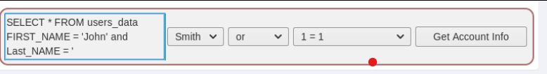
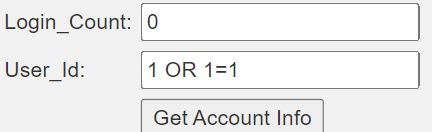
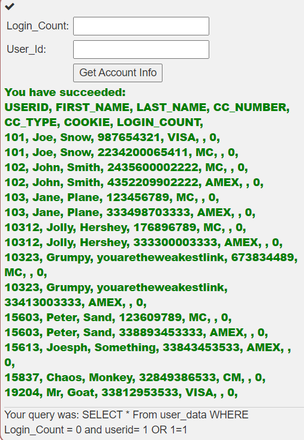
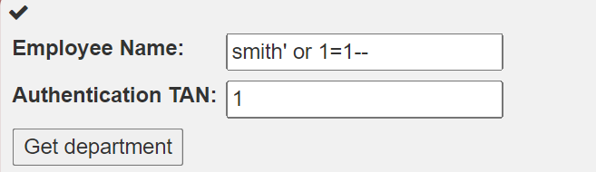
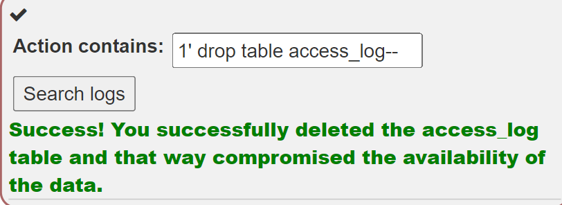
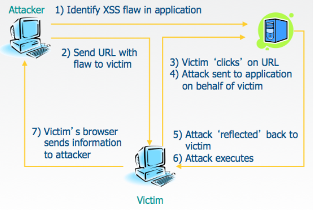

# WebGoat 실습
## 목차
1. A1 Injection  
    1-1 [(A1) Injection(intro)](#sql-injectionintro)  
2.  
3.  
4.  
5.  
6.  
7. A7 Cross-Site Scripting(XSS)  
    7-1 [Cross Site Scripting
](#a7-cross-site-scriptingxss)  

## (A1) Injection
### SQL Injection(intro)
<b>[1]</b>   
1-1에서 배울 것

- SQL이 무엇인가
- 개발자의 원래 의도가 아닌 작업을 수행하도록 조작하는 방법

<b>[2 개념]</b>  
SQL(Structured Query Language)이란?  
: 관계형 databases를 관리하고 database 안에서 data에서 다양한 작업을 수행하기 위해 사용되는 표준화된(ANSI in 1986, ISO in 1987) 프로그래밍 언어이다.  

database : data의 모임 <br>   
data : 행들, 열들, 테이블들로 구성됨 그리고 관련 정보를 쉽게 찾을 수 있도록 indexing 됨  
<br>  


[2의 문제]  <br>
아래 Employees Table에서 Bob Franco의 부서를 이끌어 내라  <br>

[2의 답]  


<b>[3 개념]</b>  
DML(Data Manipulation Language)란?  
: 테이블 안에 있는 데이터를 다룬다.  

- SELECT : 하나의 database로부터 데이터를 도출한다.
- INSERT : 하나의 table에 데이터를 삽입한다.
- UPDATE : 하나의 table 내부에 존재하는 데이터를 update(수정) 한다.  
- DELETE : 한 database table로부터 모든 기록들을 삭제한다.  

[3의 문제]   
Tobi Barnett의 부서를 'Sales'로 부서를 바꿔봅시다. <br>
[3의 답]


<b>[4 개념]</b>  
DDL(Data Definition Language)란?  
: 데이터를 정의하는 언어  
: 어떤 데이터 베이스, 스키마, 테이블이 필요한지 등 데이터의 구조를 설계  

- CREATE : 데이터베이스, 테이블 등을 생성
- ALTER : 존재하는 데이터베이스, 테이블의 구조를 수정한다.
- DROP : 데이터베이스, 테이블을 삭제

[4의 문제]  
employees 테이블에 "phone" column(varchar(20))을 추가하여 scheme를 수정해봅시다.  <br>
[4의 답]


<b>[5 개념]</b>  
DCL(Data Control Language)란?  
: 데이터 사용 권한을 주는 언어

- GRANT : 데이터베이스에 접근 권한을 허용
- REVOKE : GRANT로 인해 주어진 사용 권한을 박탈함  

[5의 문제]  
usergroup "UnauthorizedUser"에게 테이블 변경 권리를 줘봅시다. <br>
[5의 답]
<!--  -->

<b>[6 개념]</b>  
SQL injection란?  
: 가장 일반적인 웹 해킹 기술  

SQL injection 공격  
: 클라이언트에서 응용 프로그램으로 SQL 쿼리 입력을 통해 악성 코드를 insertion 또는 injection 하는 것으로 구성 됨  
: 데이터의 무결성 및 보안 등에 심각한 영향을 미칠 수 있음  

**[7 개념]**
SQL injection 성공이 도출할 수 있는 것 : 
- 데이터베이스에서 중요한 데이터 읽기 및 수정  
- 데이터베이스에서 관리 작업 실행  
    - 감사(회계 감사, 컴퓨터 감사) 또는 DBMS 종료
    - 테이블 및 로그 잘라내기
    - 사용자 추가
- DBMS 파일 시스템에 있는 지정된 파일의 내용 복구  
- 운영 체제에 명령 실행  
  
  SQL injection 공격을 통해 공격자가 할 수 있는 것 :  
  - Spoof identity
  - 기존 데이터 조작
  - 트랜잭션 무효화 또는 balances 변경과 같은 거부 문제 발생
  - 데이터 삭제 혹은 사용할 수 없도록 설정
  - 데이터베이스 서버의 관리자가 됨 

**[8 개념]**
SQL injection 공격 제한 시키는 방법  
- 공격자의 기술과 상상력
- 심층방어대책
    - 입력 유효성 검사
    - 최소 권한
- 데이터베이스 기술
  
일부 데이터베이스는 명령 체인을 지원하지 x
- Microsoft Access
- MySQL Connector/J and C
- Oracle  

[9의 문제]->String SQL injection    
user_data 테이블의 모든 정보를 다 가져오도록 쿼리를 작성하시오  

[9의 답]  


[10의 문제]->Numeric SQL injection  
user_data 테이블의 모든 정보를 다 가져오도록 쿼리를 작성하시오  

[10의 답]



**[11 개념]**
String SQL injection으로인한 기밀성 저하

String SQL injection이란?  
:쿼리가 응용프로그램에 문자열을 연결하여 동적으로 작성되면 응용프로그램이 String SQL injection에 매우 취약해짐  
:입력이 쿼리에 삽입된 문자열을 문자열 매개 변수로 사용하는 경우 따옴표를 사용하여 빌드 쿼리를 쉽게 조작하여 특정 요구에 맞는 문자열을 구성할 수 있음.  
(예, 문자열 매개 변수를 따옴표로 끝내고 그 다음에 고유한 SQL을 입력할 수 있다.)  


[11의 문제]  
employees 테이블의 모든 정보를 다 가져오도록 쿼리를 작성하시오  

[11의 답]  



[12 개념]  
Query chaining으로 무결성 손상  
: 공격자가 엑세스 할 수도 없는 정보를 변경할 경우 모든 데이터의 무결성이 손상 될 수 있음  

SQL Query chaining이란?  
실제 쿼리 끝에 하나 이상의 쿼리를 추가하는 것   
둥일한 줄 내에서 쿼리 바로 뒤에 다른 쿼리를 시작할 수 있는 ; 메타 문자를 사용하여 이 작업을 수행할 수 있다.  

[12의 문제]  
Tobi와 Bob이 당신(smith)보다 연봉이 많다라는 사실을 알았다. 당신의 연봉이 가장 많게 수정하시오


[12의 답]  
Smith
3SL99A';
update employees set SALARY=83700 where last_name='Smith'--

**[13 개념]**
가용성 저하  
가용성 위반하는 방법  
- 계정이 삭제되거나 암호가 변경되면 실제 소유자가 더 이상 계정에 엑세스 할 수 없다.  
- 공격자는 데이터베이스의 일부를 삭제하여 데이터베이스를 쓸모없게 만들거나 전체 데이터 베이스를 삭제 할 수 있다.  

[13의 문제]   
access_log 테이블에 기록이 남아있다. 이 테이블을 삭제시켜라  
[13의 답]



## (A7) Cross-Site Scripting(XSS)
### Cross Site Scripting
<b>[1]</b>   
7-1에서 배울 것  

- XSS(Cross-Site-Scripting)이란 무엇인가  
- 개발자의 원래 의도가 아닌 작업을 수행하도록 조작하는 방법

<b>[2 개념]</b>  
XSS란?  
: 취약점/결함  
: 가장 일반적이고 치명적인 웹 애프리케이션 보안 문제   
-> 이 공격에 대해 잘 알려진 간단한 방어 수단이 있지만, 웹에는 여전히 많은 사례가 있다. 수정과 관련하여 수정의 적용 범위도 문제가 되는 경향이 있다.   
: 자바스크립트를 통해 연결된 권한 있는 함수 호출 훼손될 수 있고, 제대로 보호되지 않으면 중요한 데이터(ex: 인증 쿠키)가 도용되어 다른 사용자의 용도로 사용될 수 있다.  
-> 예, 브라우저의 개발자 도구(크롬, Firefox)에 있는 JavaScript 콘솔에서  
```
alert("XSS Test");  
alert(document.cookie);    
```
-> 예, 클라이언트로 반환되는 모든 데이터 필드는 잠재적으로 주입 가능  
```
<script>alert("XSS Test")</script>  
```
[2의 문제]  
(chrome 또는 Firefox를 사용해라)  

- 두 번째 탭을 열고 너가 현재 있는 이 페이지와 같은 url을 사용해라.  
- 그러고 열려있는 두 번째 브라우저 개발자 도구를 열고 Javascript 콘솔을 연다.
alert(document.cookie);를 입력한다.  
각 탭에 있는 그 쿠키들은 같나요?  

[2의 답]  
yes  

**[3 개념]**  
가장 일반적인 위치  
- 검색 문자열을 다시 사용자에게 반향시키는 검색 필드  
- 사용자 데이터를 반향하는 입력 필드  
- 사용자 제공 텍스트를 반환하는 오류 메시지  
- 사용자 제공 데이터가 들어 있는 숨겨진 필드  
- 사용자 제공 데이터를 표시하는 모든 페이지  
    - 게시판  
    - 자유 양식 주석  
- HTTP 헤더  

**[4 개념]**  
xss 공격의 결과가 될 수 있는 것  
- 세션 쿠키들을 훔치는 것  
- 잘못된 응답 생성  
- 인증 정보를 수집하기 위해 페이지에 잘못된 필드 작성 
- 너의 페이지를 "non-friendly" 사이트로 재설정
- 유효한 사용자로 가장하는 요청 생성
- 기밀 정보 도용
- 최종 사용자 시스템에서 악성 코드 실행(active scripting)  
- 적대적이고 부적절한 내용 삽입  
```
">GoodYear recommends buying BridgeStone tires...
```
XSS 공격은 phishing 공격에 유효성을 추가한다.
- URL에 유효한 도메인이 사용되었다.

**[5 개념]**  
XSS의 유형들  
반사됨
- 사용자 요청의 악성 콘텐츠가 웹 브라우저에서 사용자에게 표시됨  
- 서버 응답 후 페이지에 악성 콘텐츠가 기록된다.  
- 사회공학이 필요하다  
- 브라우저에서 사용자로부터 상속된 브라우저 권한으로 실행된다.  

DOM 기반(기술적으로도 반영 됨)  
- 클라이언트 측 스크립트에서 사용자 요청의 악의적인 콘텐츠를 사용하여 자신의 페이지에 HTML을 작성한다.  
- 반사된 XSS와 유사하다.
- 브라우저에서 사용자로부터 상속된 브라우저 권한으로 실행된다.  

저장 또는 영속성  
- 악성 콘텐츠는 서버(데이터베이스, 파일 시스템 또는 기타 개체)에 저장되고 나중에 웹 브라우저에서 사용자에게 표시된다.  
- 소셜 엔지니어링이 필요하지 않는다.  

**[6 개념]**  
반사된 XSS 시나리오  
- 공격자가 악의적인 URL을 공격 대상자에게 보낸다. 
- 공격 대상자가 악의적인 웹 페이지를 로드하는 링크를 클릭한다.  
- URL에 포함된 악의적인 스크립트가 공격 대상자의 브라우저에서 실행된다.
- 이 스크립트는 세션 ID와 같은 중요한 정보를 도용하여 공격자에게 준다.
  
 피해자는 공격이 발생한 것을 인식하지 못한다.

 
**[7 개념]**  
XSS의 영향을 받기 쉬운 필드 식별  
  
항상 서버 측의 모든 입력을 확인하는것이 좋은 방법이다.  
유효하지 않은 사용자 입력이 HTTP 응답에 사용될 때 XSS가 발생할 수 있다.  
반사된 XSS 공격에서 공격자는 공격 스크립트로 URL을 만들어 다른 웹 사이트에 게시하거나 전자 메일로 보내거나 공격 대상자가 클릭하도록 할 수 있다.  
  
필드가 XSS 공격에 취약한지 쉽게 확인할 수 있는 방법은 alert() 또는 console.log()메서드를 사용하는 것이다. 그 중 하나를 사용하여 취약한 필드를 확인한다.  
  
**[8 개념]**

Self XSS 또는 reflected XSS  


**[9 개념]**  

반사된 그리고 DOM-기반 XSS  
: DOM-based XSS는 반사된 XSS의 또다른 형태  
(공통점)  
둘 다 브라우저에 반영되는 입력이 포함된 링크를 전송하여 유발된다.  
(차이점)  
DOM의 경우 페이로드가 서버로 전송되지 않는다. 그것은 고객에 의해서만 처리 됨  
- 공격자가 공격 대상자에게 악의적인 URL을 보낸다.  
- 피해자가 링크를 클릭한다. 
- 이 링크는 취약한 경로/처리기가 있는 악의적인 웹 페이지 또는 사용자가 사용하는 웹 페이지를 로드할 수 있다. 
- 악의적인 웹 페이지인 경우 자체 JavaScript를 사용하여 취약한 경로/처리기로 다른 페이지/URL을 공격할 수 있다.  
- 취약한 페이지는 페이로드를 렌더링하고 해당 페이지/사이트에서 사용자의 컨텍스트에서 공격을 실행한다.  
- 공격자의 악의적인 스크립트가 로컬 계정의 권한으로 명령을 실행할 수 있음  

공격 대상자가 공격이 발생한 것을 인식하지 못함  
- 악의적인 공격자는 <script>alert('XSS')//script>를 사용하지 않는다.  

**[10 개념]**  
DOM 기반 XSS의 잠재력 발견
: DOM 기반 XSS는 일반적으로 클라이언트 측 코드에서 경로 구성을 검색하여 찾을 수 있습니다.  
: 페이지에 반사되는 입력을 가져오는 경로를 찾는다.  
 
 
[12 문제 & 답]
1. 신뢰할 수 있는 웹 사이트는 XSS 공격의 영향을 받지 않습니까?

(1) 예. 브라우저가 실행하기 전에 코드를 확인하므로 안전합니다.
(2) 구글은 악성코드를 차단하는 알고리즘을 가지고 있기 때문에 그렇습니다.
(3) 아니요. 실행되는 스크립트가 브라우저의 방어 알고리즘을 뚫기 때문입니다.
(4) 아니요. 신뢰할 수 있는 것으로 확인되면 브라우저가 웹 사이트를 신뢰하기 때문에 브라우저는 스크립트가 악의적이라는 것을 알지 못합니다.

답 : (4)

2. XSS 공격은 언제 발생합니까?

(1) 데이터는 신뢰할 수 있는 소스를 통해 웹 애플리케이션에 들어갑니다.
(2) 웹 사이트를 통해 브라우저 응용 프로그램에 데이터가 입력됩니다.
(3) 데이터는 악성 콘텐츠에 대한 검증 없이 웹 사용자에게 전송되는 동적 콘텐츠에 포함됩니다.
(4) 데이터는 검증되지 않은 상태로 전송되는 정적 콘텐츠에서 제외됩니다.

답 : (3)

3. stored XSS 공격이란 무엇입니까?
(1) 스크립트는 서버에 영구적으로 저장되며 공격 대상자는 서버에서 정보를 요청할 때 악의적인 스크립트를 가져옵니다.
(2) 스크립트는 공격 대상자의 컴퓨터에 자체를 저장하고 로컬로 악성 코드를 실행합니다.
(3) 스크립트는 공격 대상자의 컴퓨터에 바이러스를 저장합니다. 이제 공격자는 다양한 작업을 수행할 수 있습니다.
(4) 스크립트가 브라우저에 저장되어 공격자에게 정보를 보냅니다.

답 : (1)

4. Reflected XSS 공격이란 무엇입니까?

(1) 반사 공격은 데이터베이스에서 웹 서버로 악성 코드를 반영한 다음 사용자에게 다시 반영합니다.
(2) 삽입된 스크립트를 웹 서버에 반영합니다. 웹 서버로 전송된 입력이 요청의 일부일 때 발생합니다.
(3) 반사 공격은 방화벽에서 사용자가 정보를 요청하는 데이터베이스로 반영됩니다.
(4) Reflected XSS는 주입된 스크립트가 데이터베이스 및 웹 서버에서 사용자에게 반영되는 공격입니다.

답 : (2)

5. XSS 공격을 수행할 수 있는 유일한 방법은 자바스크립트입니까?

(1) 예. JavaScript를 통해서만 태그를 사용할 수 있습니다.
(2) 예, 그렇지 않으면 쿠키를 훔칠 수 없습니다.
(3) 아니요, ECMA스크립트도 없습니다.
(4) 아니요, 다른 많은 방법이 있습니다. HTML, 플래시 또는 브라우저가 실행하는 다른 유형의 코드와 같습니다.

답 : (4)
