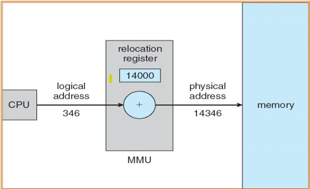

## 8장 기억장치 관리

## 목차 
1. [주소 바인딩](#주소-바인딩address-binding)

### 주소 바인딩(Address Binding)
: 프로그램의 명령어와 데이터를 기억장치에 적재할 때, 그것들의 기억장치 주소를 결정하는 것  
: 프로그램에서 사용하는 심볼 (전역변수, 함수)은 기억장치의 어떤 주소가 있어야 실행될 때 그 주소를 사용하여 접근(읽기/쓰기)할 수 있음  
ex) 컴파일러는 심볼의 주소를 재배치 가능 주소로 바인딩 한다.
실행파일을 실행하면, 운영체제는 재배치 가능 주소를 절대 주소로 바인딩한다.

>주소 바인딩 종류
>1. 컴파일 시간 바인딩
>- 컴파일 시간에 절대 코드(absolute code)를 생성한다.
- 프로그램을 기억장치 내에 적재할 위치를 컴파일 시간에 결정
- 적재 위치를 바꾸려면 다시 컴파일 해야 한다.
2. 적재 시간(load time) 바인딩
> - 컴파일 시간에 재배치 코드(relocatable code)를 생성한다.
>- 적재 시간에 적재할 위치를 결정함
3. 실행 시간(execution time) 바인딩
>- 프로세스가 실행 중에 기억장치의 한 세그먼트로부터 다른 세그먼트로 이동될 수 있다.
>- 바인딩은 실행시간에 결정됨

동적 적재 (dynamic loading)
- 함수가 호출될 때까지 디스크에 재배치 가능 적재 형태로 존재하다가, 호출되면 기억장치로 적재됨  
- 호출되지 않는 함수는 적재되지 않기 때문에 기억장치 공간의 사용률을 높일 수 있다.

동적 연결 (dynamic linking)
- 정적 연결(static linking) 
라이브러리와 프로그램이 컴파일될 때 정적으로 연결되어 실행 파일 안에 존재한다.
- 동적 연결(dynamic linking)
라이브러리가 실행파일에 있지 않고 연결 정보만 존재. 실행 시간(runtime)에 라이브러리 함수가 호출될 때 동적으로 연결되며 기억장치에 적재된다.  

논리 주소(Logical address)  
: 프로세스를 실행하면서 CPU가 생성하는 주소, 가상주소(virtual address)라고도 함  
  
논리 주소 공간   
: 프로세스가 실행하면서 생성되는 모든 논리 주소 집합  
  
물리 주소(physical address)  
: 기억장치가 나타내는 주소, 실제 주소라고도 함  
  
물리 주소 공간
: 이 논리 주소와 대응하는 모든 물리 주소 집합  

주소변환(Address Translation)  
:CPU에서 생성되는 논리 주소를 물리 주소로 변환하는 것  
  
MMU (Memory Management Unit)  
- 주소 변환을 해주는 하드웨어 장치  
- 프로세스가 생성하는 논리주소에 재위치 레지스터(relocation register)의 값을 더해서 물리 주소를 구한다.

운영체제는 어떤 프로세스에게 CPU를 할당하여 실행시킬 때, 그 프로세스의 시작 위치를 MMU의 재위치 레지스터에 셋팅한다.  
이 후, 프로세스가 CPU에 의해 실행될 때 생성되는 논리 주소는 MMU에 의해 물리 주소로 변환된다.

기억장치 할당 기법
:os는 프로세스가 기억장치에 적재되어 수행될 수 있도록 프로세스에게 기억장치를 할당해야 한다.  
  
할당 기법  
- 연속 할당 기법 
- 페이징
- 세그먼테이션
- 페이지화된 세그먼테이션

연속 할당 기법  
:프로세스를 나누지 않고 기억장치에 적재하는 방법  
: 운영체제는 프로세스를 기억장치 내의 가용 공간에 적재함
-> 프로세스들이 적재되고, 제거되면서 가용 공간이 곳곳에 만들어짐  
-> 운영체제는 기억장치의 사용 상태를 관리함  
(어떤 프로세스가 어느 공간을 사용하고 있고, 어느 공간은 가용 상태인지 관리해야 함)  
  
프로세스를 적재할 때 가용 공간 중에서 어느 가용 공간에 적재할 것인가?  
- 최초 적합(First-fit)
: 충분한 것 중에서 첫 번째 가용 공간에 할당  
- 최적 적합(Best-fit)  
: 충분한 것 중에서 가장 작은 가용 공간에 할당. 가장 작은 hole을 만들게 됨  
- 최악 적합(worst-fit)  
: 충분한 것 중에서 가장 큰 가용 공간에 할당. 가장 큰 hole을 만들게 됨  

단편화(Fragmentation) 문제  
- 외부 단편화(External fragmentation)  
: 프로세스들이 적재되고 제거되면서, 가용 기억 공간이 작은 조각들로 나누어진다.  
: 어떤 프로세스를 위해서 가용한 기억 공간의 합은 충분한데, 공간이 연속되지 않았을 때 발생하는 단편화  
(해결책)  
압축  
: 프로그램들을 이동시켜서 모든 가용 공간을 하나의 가용 공간으로 만듦  
: 프로그램의 주소 바인딩 방법이 실행시 바인딩이어야 가능함  

내부 단편화(Internal fragmentation)  
: 할당한 기억 공간에서 사용되지 않는 부분이 남을 때 발생하는 단편화  
  
**페이징**
:프로세스를 페이지(page)라는 단위로 쪼개서 기억장치에 적재하는 기법  
물리적 기억 장치(physical memory)는 프레임(frame)이라 부르는 블록으로 나누어진다.  
(보통 프레임 크기는 512B ~ 8KB)  
프로세스의 논리 주소 공간(logical memory)은 페이지(page)라 부르는 블록으로 나누어 진다.
(page 크기 = frame 크기)  
외부 단편화 문제 없음
내부 단편화 문제는 발생할 수 있음  

페이지 테이블   
-> 페이지가 어떤 프레임에 적재되었는 지를 관리하기 위해 페이지 테이블이 필요함  
: 논리 주소를 물리 주소로 맵핑하기 위한 테이블   
: 페이지 맵 테이블, 페이지 맵핑 테이블 등으로 불리기도 함  

1. OS는 각 프로세스마다 페이지 테이블(PT)을 생성한다.
2. OS는 어떤 프로세스에게 CPU를 할당하여 실행시킬 때, 그 프로세스의 페이지 테이블의 시작 위치를 MMU의 레이즈터에 셋팅한다.  
3. 이 후, 프로세스가 CPU에 의해 실행될 때 생성되는 논리 주소는 MMU에 의해 물리 주소로 변환된다. 
4. MMU는 레지스터에 셋팅되어 있는 페이지 테이블 정보를 이용해서 논리 주소를 물리 주소로 변환시킨다.  

논리 주소 구성
CPU가 생성하는 논리주소 구성
1. 페이지 번호(Page number(p)) - 페이지 테이블의 인덱스로 사용
2. 페이지 변위(Page offset(d)) - 페이지 내부에서의 몇 번째 바이트인지

예로, 논리 주소 공간의 크기가 $2^m$이고, 페이지 크기가 $2^n$일 때  
- 논리 주소의 상위 m-n 비트 : 페이지 번호  
- 논리 주소의 하위 n 비트 : 페이지 변위(페이지 내에서의 위치)

