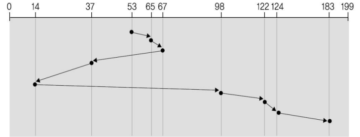
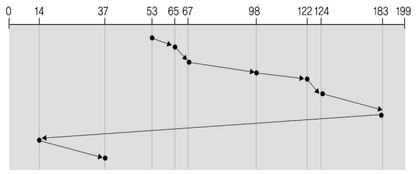
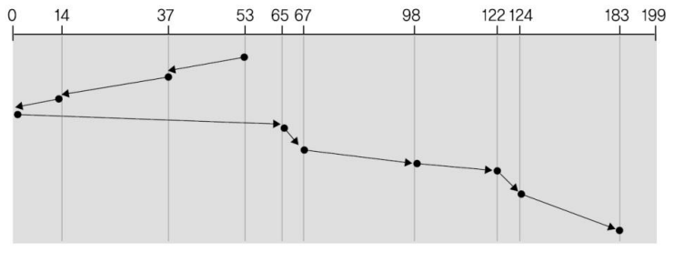

## 6장 프로세스 동기화
### 병행 프로세스들이 공유 데이터를 병행 접근할 때 데이터의 일관성이 잘못되는 경우를 예를 들고, 그 이유를 설명하시오.  

병행 프로세스들이 변수같은 공유 데이터를 같이 이용하고 있기 때문에 동시에 수행되면 문맥교환 등의 사건으로 데이터의 일관성이 잘못될 수 있다.그렇기 때문에 순서화하여 하나씩 수행되게 해야 하며 만약 순서화되지 않고 수행된다면 데이터의 일관성이 잘못되는 문제가 발생하게 된다. 

### 임계구역 문제의 해결 방법 중에서 세마포어에 대해 자세히 설명하시오
- 정수 변수로서 오직 두 개의 연산으로만 접근.  
- 임계구역에 들어가기 전에 수행하는 연산(wait), 임계 구역에서 나올때 수행하는 연산(signal)  
- 두 연산에서 세마포어 변수의 접근은 원자적으로 수행됨(변수 접근 도중에 인터럽트되지 않음)   
- binary 세마포어(0과 1값만을 사용. 초기값을 1로 함.)  
- counting 세마포어(제약이 없는 정수값 사용. 초기값을 n으로 함.)  
- 교착 상태가 발생할 수 있다.(두 개가 무한히 기다리게 될 수도 있다.)  

### 세마포어를 사용하여 교착 상태가 발생하는 예를 들고, 그 이유를 설명하시오 
두 개 이상의 프로세스들이 다른 프로세스가 해주어야 하는 사건을 무한하게 기다리는 현상이 
발생할 수 있다. 프로세스의 순서가 바뀌게 되면 교착상태가 발생할 수 있다. 초기값이 1이라고 가정했을 때, 두 개의 세마포어 사이에 문맥교환이 일어나면 값이 계속 0이 
되기 때문에 무한으로 기다리게 된다.

### <임계구역 문제 해결 3가지>
1. 상호배제 : 프로세스가 임계 구역에서 실행된다면, 다른 프로세스들은 임계구역에서 실행될 수 없다.
2. 진행 : 임계구역에서 실행되는 프로세스가 없고 임계구역을 수행하려는 프로세스가 있다면 진행시켜 수행하도록 해야 한다.
3. 한계 대기 : 여러 개의 프로세스들이 임계구역을 수행하려 할 때 임계구역을 수행하도록 허용하는 횟수에 한계를 두어야 한다.

## 7장 교착상태

### 교착상태가 발생하기 위한 4가지 조건들을 설명하시오. 이 중에서 한 가지 조건에 대해 교착상태를 예방하기 위한 방법을 설명하시오.

1. 상호배제(Mutual exclusion) : 한번에 오직 하나의 프로세스만이 자원을 사용할 수 있다. 
2. 점유와 대기(Hold and wait) : 프로세스가 적어도 하나의 자원을 점유하면서 다른 프로세스가 이미 점유하고 있는 자원을 추가적으로 얻기 위해 대기한다. 
3. 비선점(No preemption) : 점유된 자원은 강제로 반환될 수 없고, 점유하고 있는 프로세스가 작업을 마치고 자원을 자발적으로 반환한다. 
4. 순환대기(Circular wait) : 대기하고 있는 프로세스 집합(P0, P1,...,Pn)에서는 P0은 P1이 점유한 자원을 대기하고, P1은 P2가 점유한 자원을 대기하고, Pn-1은 계속해서 Pn을 대기하며, Pn은 P0이 점유한 자원을 대기한다. 

예방 방법   
- 상호배제  
: 공유 가능한 자원들은 동시 접근을 허용한다.  
- 순환대기 예방 방법  
: 모든 자원 유형에 일련 번호를 부여하고, 프로세스는 오름차순으로 자원을 요청한다.  

### 교착 상태 회피 방법과 탐지 방법의 차이점을 설명하시오  
각 자원 유형이 여러 자원을 가진 경우, 회피 알고리즘(은행가 알고리즘)에서는 프로세스들이 
사용할 자원의 최대 개수를 선언했었는데, 탐지 알고리즘에서는 최대 개수를 선언하지 않는
다. 회피 알고리즘은 자원을 할당한 후에 안정 상태인지 검사했는데, 탐지 알고리즘에서는 현재 
상태를 검사해서 교착 상태가 있는지를 검사한다. 탐지 알고리즘은 주기적으로 수행해야 한
다. 회피 알고리즘은 자원을 요청할 때마다 그 다음 상태를 매번 검사해야 하는데 탐지 알고리즘
은 주기적으로 수행한다(1시간에 1번, 하루에 1번 등). 탐지 알고리즘은 주기적으로 수행하여 
현재 상태가 교착상태인지 검사한다

### 은행가 알고리즘에 대한 문제이다. 5개의 프로세스와 3개의 자원 유형을 가진 시스템이 있다. 자원 유형은 A, B, C이며 각 자원의 개수는 10, 5, 7개이다. 다음은 현재 시간의 상태표이다.
||allocation|max|
|:----:|:----:|:-----:|
||A B C|A B C|
|P0|0 1 0|7 5 3|
|P1|2 0 0|3 2 2|
|P2|3 0 2|9 0 2|
|P3|2 1 1|2 2 2|
|P4|0 0 2|4 3 3|
### 1. P1이 (1,0,2)를 요청하면 다음 상태가 어떻게 되는지 문제에서 제시한 상태표를 이용하여 쓰시오. 또한, 안정상태인지 아닌지 설명하시오  
- 안정상태이다. 그 이유는 아래와 같은 안정 순서가 존재하기 때문이다.
안정 순서 : <P1, P3, P0, P2, P4> <P1, P3, P0, P4, P2>
  <P1, P3, P2, P0, P4> <P1, P3, P2, P4, P0>
<P1, P3, P4, P0, P2 > <P1, P3, P4, P2, P0>
<P1, P4, P3, P0, P2> <P1, P4, P3, P2, P0>

### 2. 위 1.을 수행한 후, P4가 (3, 4, 0)을 요청하면 허용되는가? 허용 여부와 그 이유를 쓰시오  
:자원 부족이므로 허용 불가  

### 3. 위 1.을 수행한 후, P0이 (0, 2, 0)을 요청하면 허용되는가? 허용 여부와 그 이유를 쓰시오
:불안정 상태가 되므로 허용 불가  

||allocation|max|Available|need|
|:----:|:----:|:-----:|:---:|:---:|
||A B C|A B C|A B C|A B C|
|P0|0 3 0|7 5 3|2 1 0|7 2 3
|P1|2 0 0|3 2 2||0 2 0
|P2|3 0 2|9 0 2||6 0 0
|P3|2 1 1|2 2 2||0 1 1
|P4|0 0 2|4 3 3||4 3 1

## 제 8장 기억장치 관리 
###
<단편화 문제 2가지>  
외부 단편화  
- 프로세스들이 적재되고 제거되면서 가용 기억 공간이 작은 조각들로 나누어진다.
- 어떤 프로세스를 위해서 가용한 기억 공간의 합은 충분한데, 공간이 연속되지 않았을 때 발생하는 단편화
- 해결책은 압축이라는 방법이다.(프로그램들을 이동시켜 모든 가용 공간을 하나의 가용 공간으로 만든다.)

내부 단편화
- 할당된 기억 공간에서 공간 내부에 사용되지 않는 부분이 남을 때 발생하는 단편화 (페이징에서 발생)

### MMU가 주소 변환 과정에서 발생시킬 수 있는 인터럽트 2가지를 설명하시오   
1. 주소 변환 도중에 해당 페이지의 유효-무효 비트가 0이면, 페이지 부재(page fault) 인터럽트가 발생함
(MMU에서 인터럽트를 일으킴)
2. 요구 페이징은 새로 참조된 페이지가 기억장치에 없으면, 그 페이지를 기억장치에 적재시킴
- 주소 변환 과정에서 페이지 부재 인터럽트를 발생하고 운영체제가 수행되며 운영체제는 새 페이지를 기억장치에 적재시킴 

### 주소 바인딩의 3가지 유형을 설명하시오

1. 컴파일 시간 (compile time) 바인딩
- 컴파일 시간에 절대 코드(absolute code)를 생성한다.
- 프로그램을 기억장치 내에 적재할 위치를 컴파일 시간에 결정함.
- 적재 위치를 바꾸려면 다시 컴파일 해야 한다.

2. 적재 시간 (load time) 바인딩
- 컴파일 시간에 재배치 코드(relocatable code)를 생성
- 적재 시간에 적재할 위치를 결정함

3. 실행 시간 (execution time) 바인딩
- 프로세스가 실행 중에 기억장치의 한 세그먼트로부터 다른 세그먼트로 이동될 수 있다.
- 바인딩은 실행시간에 결정됨

### 계층적 페이징 기법을 설명하시오 

계층적 페이징 (페이지 테이블 구조)
 : 페이지 테이블 전체 내용을 메인 메모리에 연속적으로 할당하는 대신에, 페이지 테이블을 페이지 단위로 나누고, 필요한 부분만 메인 메모리에 할당함 (페이지 테이블 자체를 페이지화)  

  

### 다음 그림은 페이징 기법의 논리 주소 구조이다. 한 프로세스의 논리 주소 크기는 4GB이고, 한 페이지의 크기는 8KB이다. 다음 그림에서 p와 d의 비트 수를 계산하시오.

: p = 20, d = 12
KB = 2^10이고, GB = 2^30이다.
4 GB는 4 * 2^30 = 2^2 * 2^30 = 2^32이다.
4 KB는 4 * 2^10 = 2^2 * 2^10 = 2^12이다.
32 - 12 = 20이다. 페이지 번호(P)를 나타내는 비트는 20비트이고, 변위(d)를 나타내는 비트는 12비트이다.

### 페이징 기법을 사용하는 64비트 컴퓨터에서 논리 주소의 구성에 대한 문제이다. 페이지 크기가 4096바이트일 때 논리주소를 구성하는 페이지 번호의 비트 수와 페이지 변위의 비트 수를 구하시오. 

논리주소 공간 크기 $2^{64}$,  페이지 크기 4096바이트 = $2^{12}$byte   
페이지 번호 p : m-n  => 64-12  
페이지 변위 d : n  => 12  
m = 논리 주소 공간의 크기는 $2^m$  
n = 페이지 크기는 $2^n$

### 어떤 컴퓨터가 16 바이트의 페이지 크기와 1024바이트의 물리 메모리를 사용한다. 어떤 프로세스의 페이지 테이블의 내용이 다음과 같다. 이 프로세스의 논리주소 30의 실제 주소를 구하시오.

????????????????????????????????????????

### 메인 메모리에 페이지 테이블을 저장하는 페이징 시스템이 있다. 메인 메모리 참조는 150 나노초 걸림. 메인 메모리 참조 외에 걸리는 시간은 모두 0으로 가정함
### (1) CPU에서 메인 메모리의 데이터 참조를 하기 위해 걸리는 시간은?  
150나노초

### (2) 만약 TLB를 가지고 있어 TLB hit가 나는 경우 데이터 참조에 걸리는 시간은?(단, TLB 참조 시간은 10으로 가정함)  
hit이면 TLB 찾는 시간 + 메인 메모리 찾는 시간  
10 + 150 = 160

### (3) 데이터 참조에 걸리는 유효 접근 시간(effective access time:EAT)은 다음 식으로 구한다. TLB hit 확률이 70%일 때 EAT를 구하시오  
### EAT = (TLB hit 확률 * TLB hit시 데이터 참조시간) + (TLB miss 확률 * TLB miss시 데이터 참조 시간)
EAT = (0.7 * 160나노초) + (0.3 * (160나노초+150나노초)) = 205

### 메인 메모리에 페이지 테이블을 저자하는 페이징 시스템이 있다. 이 시스템에 TLB가 있으며 TLB 참조 시간은 10 나노초이다. 메인 메모리 참조는 20나노초이다. CPU에서 메인 메모리의 데이터 참조를 할 때 TLB miss가 나는 경우, 데이터 참조에 걸리는 시간은? 그 이유를 설명하시오.
hit면 tlb찾는 시간 + 메인메모리 찾는 시간  
tlb miss 면  hit 시간 + 메인 메모리 찾는 시간  
TLB 검색 + 페이지 테이블 접근 + 데이터 접근   
10 + 20 + 20 = 50나노초  

TLB 참조 시간이 10나노초이다. 그런데 TLB miss가 났기 때문에 페이지 테이블을 찾아야 한다. 페이지 테이블은 메모리에 있기 때문에 메모리를 참조하게 되어 20 나노초가 걸리게 된다. 그다음 데이터 참조도 한다. 데이터 참조도 메모리를 참조해야 하기 때문에 20 나노초가 걸리게 된다.
(TLB)10 나노초 + (페이지테이블)20 나노초 + (데이터)20 나노초 = 50 나노초가 걸리게 된다.

### 페이징 기법에서 주소 변환 과정을 설명하시오  
페이지 테이블을 이용하면 간단하게 가상 주소를 물리 주소로 변환할 수 있다. 페이지 테이블에서 페이지 번호를 찾아 해당 프레임 번호를 쫓아가면 된다. 가상주소 = <P,D> -> 물리주소 = <F,D>에서 P는 F로 바꾸고 D는 변경 없이 그대로 쓴다. 페이지와 프레임 크기를 똑같이 나누었기 때문이다.  

### 페이징 기법에서 페이지 테이블의 공간 문제를 해결하기 위한 방법 중에서 한 가지를 설명하시오  & 3가지 설명하시오  

계층적 페이징  
: 페이지 테이블 전체 내용을 메인 메모리에 연속적으로 할당하는 대신에, 페이지 테이블을 페이지 단위로 나누고, 필요한 부분만 메인 메모리에 할당함  

해시된 페이지 테이블  
: 일반적으로 주소 공간이 32비트 이상의 큰 경우에 사용   
페이지 번호를 해슁하여 페이지 테이블의 인덱스를 구한다. 이 페이지 테이블에는 같은 주소로 해슁된 항목들의 리스트들을 가지고 있다.  
이 리스트의 각 항목에서 페이지 번호를 비교하여 일치하는 것을 찾는다. 만약 찾게 되면 대응되는 물리적 프레임 번호를 구할 수 있다.  

역 페이지 테이블
: 기억장치의 프레임마다 하나의 항목을 가지는 테이블로 시스템 하나의 페이지 테이블만 있으면 되므로, 프로세스마다 페이지 테이블을 가지는 것보다 기억장치 공간을 절약할 수 있다.  하지만 테이블 검색 시간이 많이 걸린다.  

##  9장 가상 기억 장치

### 페이지 교체 알고리즘에서 전역 교체와 지역 교체를 설명하시오
:전역 교체는 모든 프레임에서 교체할 프레임을 선택하는 방법이고 지역 교체서의 각 프로세스는 자신에게 할당된 프레임 중에서 교체할 프레임을 선택  

### 다음 그림을 설명하시오 && 다음 그림에서 보여주는 문제점과 그 이유를 설명하시오. 이 문제를 해결하는 방법을 예를 들어 설명하시오  
<image src = "../image/스레싱.png" width = 55%>
다중 프로그래밍의 정도가 높아짐에 따라 CPU 사용률이 높아지지만, 다중 프로그래밍의 정도가 어느 한도를 넘게되면 스레싱이 일어나고 CPU 사용률도 급격히 떨어진다. 
이런 경우 CPU 사용률도 높이고 스레싱을 중지하려면, 다중 프로그래밍이 정도를 낮추어야 한다.    

### 2차 기회(Second chance) 페이지 교차 알고리즘을 설명하시오
: 페이지마다 참조 비트가 있으며 이들은 순환 큐로 관리됨  
: 포인터(next victim)가 다음에 교체될 페이지를 가리킨다.
: 교체할 프레임이 필요해지며, 포인터는 참조비트는 0인 것을 발견할 때까지 계속 찾으면서 참조비트들을 0으로 지운다. 
: 즉, 참조비트가 1인 것은 2차 기회를 제공하면서 포인터는 큐를 한바퀴 돈다.  
: 참조비트가 0인 것을 찾게 되면, 그 페이지는 교체되고 새로운 페이지가 그 위치에 삽입된다.  
### 또한 2차 기회 알고리즘이 LRU 근사 알고리즘인 이유를 설명하시오  
LRU 근사 알고리즘이 각 페이지에 참조 비트를 둔다.(초기값은 0) 페이지가 참조되면 1로 셋팅하고 비트가 0인것을 교체하는 알고리즘이기 때문이다.  

### Belady's anomaly를 예를 들어 자세히 설명하시오
프레임이 많아졌는데 페이지 부재 횟수가 오히려 증가하는 현상을 말한다. 그러면 더 이상 메모리를 더 꽂을 수가 없다. 메모리를 꽂았는데 횟수가 더 증가하여 성능이 안좋아진다. FIFO 알고리즘은 이러한 현상 때문에 문제가 있어 사용할 수 없는 알고리즘이다.   
Belady's Anomaly를 보여주는 메모리 참조열은 1,2,3,4,1,2,5,1,2,3,4,5 이다.  

### 페이지 부재 처리 과정을 설명하시오 
- 페이지에 대한 참조가 첫 번째 참조라면 페이지 부재가 발생되고 운영체제에게 제어가 넘어간다.
- 운영체제는 다음 둘 중 어떤 상황인지를 검사한다.
    - 잘못된 참조라면 프로세스를 중시(abort)시킴
    - 메모리에 없는 것이라면 메모리에 페이지 적재
- 비어있는 프레임을 찾는다.
- 페이지를 프레임에 적재한다.
- 페이지 테이블 값을 변경한다. (프레임 번호와 유효 비트)
- 중지된 명령어를 재시작한다.    

### 프로세스의 수행 동안에 지역성(locality)이 생기는 2가지 유형을 설명하시오 

시간 지역성 (temporal locality)  참조된 기억장소가 가까운 미래에도 시간적으로 가까운 시간에도 계속 참조될 가능성이 높다는 것이다. 순환구조의 루틴, 부프로그램, 스택이 있다.  
공간 지역성(spatial locality)는 참조된 페이지의 인접한 기억장소들이 다시 또 참조될 가능성이 높다는 것이다. 배열 검색, 순차적 코드의 실행, 근처의 관련변수 선언이 있다.  

### 다음은 어떤 프로세스의 메모리 주소 참조를 기록한 것이다.
### 0100, 0432, 0533, 0101, 0102, 0612, 0613, 0103, 0104, 0302
### 페이지 크기는 100 바이트이고 프레임 개수는 3개이다. 메모리 접근 시간은 50 nano second이고 페이지 부재 처리 시간은 20 mili second라고 가정하자. 그 외 작업에 걸리는 시간은 모두 무시하자.
### 다음 페이지 교체 알고리즘은 2 개를 사용한다고 했을 때 각 교체 알고리즘에 대해 문제를 푸시오
### 1. FIFO    2. LRU && 최적 알고리즘
### (1) 최종 메모리 상태를 보이고 페이지 부재율을 계산하시오
페이지 참조열 1 4 5 1 1 6 6 1 1 3  

최적 알고리즘
최종 메모리 상태 LRU와 동일  
페이지 부재율도 LRU와 동일

## 10장 파일 시스템

### 프로세스의 기억장치 할당 기법 중에 연속 할당기법이 있다. 연속 할당 기법에서 사용할 수 있는 가용공간 할당 방법 3가지를 설명하시오.  
- 최초 적합(First-fit) 
: 충분한 것 중에서 첫 번째 가용 공간에 할당  
- 최적 적합(Best-fit)
: 충분한 것 중에서 가장 작은 가용 공간에 할당. 가장 작은 hole을 만들게 됨  
- 최악 적합(worst-fit)
: 충분한 것 중에서 가장 큰 가용 공간에 할당, 가장  큰 hole을 만들게 됨  

### 파일 시스템에서 디스크 블록 할당 기법 3가지를 비교 설명하시오  
디스크 공간 할당 방법  
- 연속 할당 (Contiguous Allocation)
: 파일을 저장할 때 디스크의 연속된 블록을 할당하여 저장  
: 디렉토리에 파일이 저장된 시작 블록과 길이(블록의 개수)에 대한 정보를 관리  
장점   
- 순차 접근과 직접 접근이 모두 가능  
단점  
- 파일을 저장할 때 적절한 빈 블록들을 찾는 문제  
- 파일이 커지는 경우, 연속공간이 없으면 파일이 커질 수 없다.
- 외부 단편화 문제
    - 파일들이 할당되고 삭제되면서 파일에 할당된 블록들 사이에 가용 블록들이 생김
    - 새로 생성되는 파일의 크기가 커서 이러한 가용 블록에 저장할 수 없다면 외부 단편화 문제가 발생
    - 해결책 : 공간 압축  
      
- 연결 할당
: 파일의 블록을 디스크에 여기저기 저장하고, 블록들을 차례로 연결하는 방법  
: 디렉토리에 파일의 시작 블록과 마지막 블록의 번호를 저장  
: 디스크 블록마다 다음 블록 번호를 저장  
장점  
: 외부 단편화 문제가 없다.  
단점  
: 직접 접근이 어렵다.  
: 디스크 블록의 공간 소비 (다음 블록 번호를 저장해야 함)  
  
- 색인 할당  
: 파일마다 색인 블록을 갖고, 색인 블록에 파일의 모든 블록의 번호를 저장하는 방법   
: 디렉토리는 파일의 색인 블록 번호를 가진다.  
장점  
: 순차 접근과 직접 접근이 모두 가능  
: 외부 단편화 문제가 없다.  
단점  
: 색인 블록이 공간 낭비를 초래할 수 있다. 특히, 파일의 크기가 작을 때가 색인 블록이 대부분 낭비됨 

### 파일 A의 크기는 100KB이고 디스크에 저장된다. 디스크의 블록의 크기는 1KB이다. (1KB = 1024 bytes). 파일의 이름과 저장 위치는 디렉토리에 저장되어 있으며, 디렉토리는 디스크의 특정 영역에 저장되어 있다. 파일 A를 다음 3가지 방법으로 디스크에 저장하는 경우를 비교하려고 한다. 이를 위해 파일 A의 2000번째 바이트의 데이터를 읽으려 할 때, 디스크를 접근해야 하는 횟수를 계산하시오. 답을 계산한 이유를 설명하시오 
### (1) 연속 할당
2회, 디렉토리, 블록 접근   
### (2) 연결 할당
3회, 디렉토리, 블록 2개 접근  
### (3) 색인 할당
3회, 디렉토리, 색인블록, 블록 접근

### 사용자 3명이 사용하는 컴퓨터이다. 각 사용자 별로 만든 파일이 다음과 같다.
### user 1 : cat bo a
### user 2 : a data
### user 3 : b data
### 다음은 디렉토리 구조이다. 각 디렉토리 구조에대하여 위 파일들을 구성하는 예를 보이고 간단하게 설명하시오. 디렉토리 구성의 예는 강의 노트의 그림을 이용하시오 (디렉토리는 사각형, 파일은 원). 디렉토리를 구성할 때 문제가 발생한다면 구성하는 예 대신에 문제점을 적으시오
### (1) 1단계 디렉토리 구조
### (2) 2단계 디렉토리 구조
### (3) 비순환 그래프 구조(단, 사용자 user 2와 user 3는 파일 data를 공유하고 싶다.)

## 11장 보조 기억장치

### 실린더 개수가 200개인 디스크에서 입출력 큐에 다음과 같은 요청이 대기 중이다. 각 숫자는 요청 데이터가 위치하는 디스크 실린더 번호이다. 현재 디스크 헤드는 53번 실린더에 있다. 헤드는 안쪽에서 바깥쪽으로 먼저 이동한다. 최외각 실린더 번호가 0이다.
### 98, 183, 37, 122, 14, 124, 65, 67
### 다음의 스케쥴링 알고리즘으로 요청을 처리했을 때, 각각 헤드가 움직인 실린더 개수를 계산하시오.[주의] 헤드가 움직인 경로를 그림으로 그리시오
### (1) SSTF (현재 헤드 위치에 가장 가까운트랙에 요청 우선 처리)

143 - 130 = 13, 177 - 30 = 47 , 177 - 80 = 97, 80 - 14 = 66    
총 223    

### (2) C-LOOK
53 - 37 - 14 - 183 - 124 - 122 - 98 - 67 - 65
=> 16+23+169+59+2+24+31+2=326  

### (3) SCAN  
199-143=56, 199-0 = 199, 130-0=130 : 총 385  

### 번호가 0부터 199인 200개의 실린더를 가진 디스크가 있다. 실린더 0이 디스크의 최외각에 위치한다.디스크 헤드는 디스크의 안쪽으로 이동하면서 현재 실린더 143 위치에 있다. 이때, 디스크 입출력 요청 큐에 다음과 같이 80부터 130까지 요청이 도착해 있다.
### 80, 14, 177, 130
### 아래 각 디스크 스케줄링 알고리즘에서 이 요청들을 처리하기 위해서 걸리는 탐색 거리를 게산 하시오. 강의 노트의 그림처럼 계산 과정을 모두 보이시오
### (1) SSTF
### (2) C-SCAN

### 디스크 스케줄링 알고리즘 2가지를 설명하시오  
- FCFS(First Come First Served)
- SSTF(Shortest Seek Time First)
- SCAN
- C-SCAN(circular scan)
SSTF : 현재 헤드 위치에서 탐색 시간이 짧은 요청부터 처리  
SCAN : 트랙의 한쪽 방향으로 요청들을 처리하고 트랙의 끝에 도착하면 반대방향으로 요청들을 처리  
C-SCAN : SCAN과 비슷하지만 한쪽 방향으로 요청들을 처리한 후에 끝에 도착하면 처음으로 돌아가서 같은 방향으로 요청을 처리  